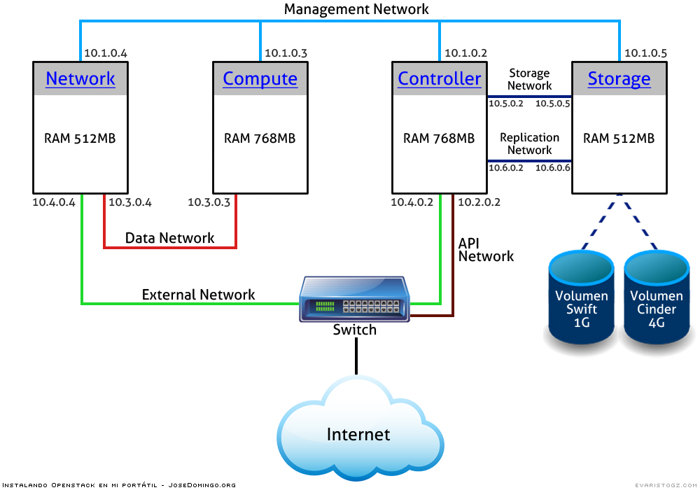

## Implantación de la infraestructura de prueba OpenStack

###Objetivos

* Implantar la infraestructura de openstack que vamos a usar durante el curso.
* Conocer los pasos que se van a producir durante la instlación de OpenStack.
* Conocer la estructuras de máuinas virtuales que se van a crear con vagrant.
* Conocer las configuraciones básicas que se van a desplegar en los distintos nodos.
* Debatir los posibles cambios que se pueden realizar a nuestra configuración para aumentar la funcionalidad.

###Contenidos

Durante esta sesión vamos a instalar OpenStack a partir del repositorio GitHub [https://github.com/openstack-ansible/openstack-ansible](https://github.com/openstack-ansible/openstack-ansible).
La infraestructura estará compuesta por 4 máquinas virtuales creadas con vagrant y la configuración de cada una de ellas realizada por medio de ansible.
Es esquema de máquinas que se levantan son las siguientes y la los podemos representar usando el siguiente esquema:

* 10.1.0.2, nodo controlador.
* 10.1.0.3, nodo de computación.
* 10.1.0.4, nodo de red (neutron).
* 10.1.0.5, nodo de almacenamiento.

* [Presentación: Instalando OpenStack en mi portatil](presentacion_instalando)
* [Instalando OpenStack en mi portatil](http://www.josedomingo.org/pledin/2014/02/instalando-openstack-en-mi-portatil/)

###Enlaces interesantes

* [https://github.com/openstack-ansible/openstack-ansible](https://github.com/openstack-ansible/openstack-ansible)
