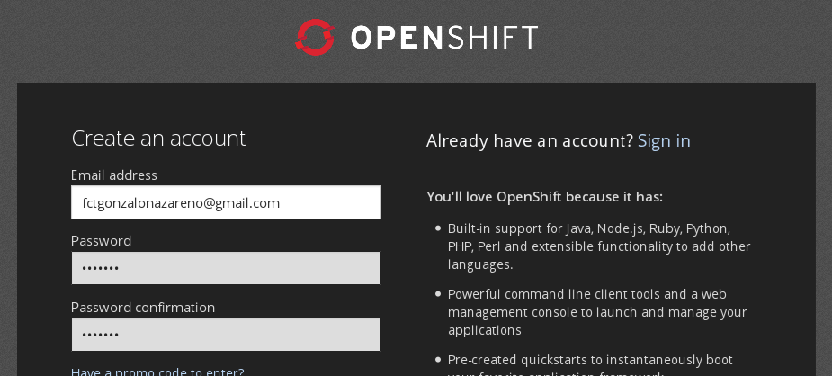
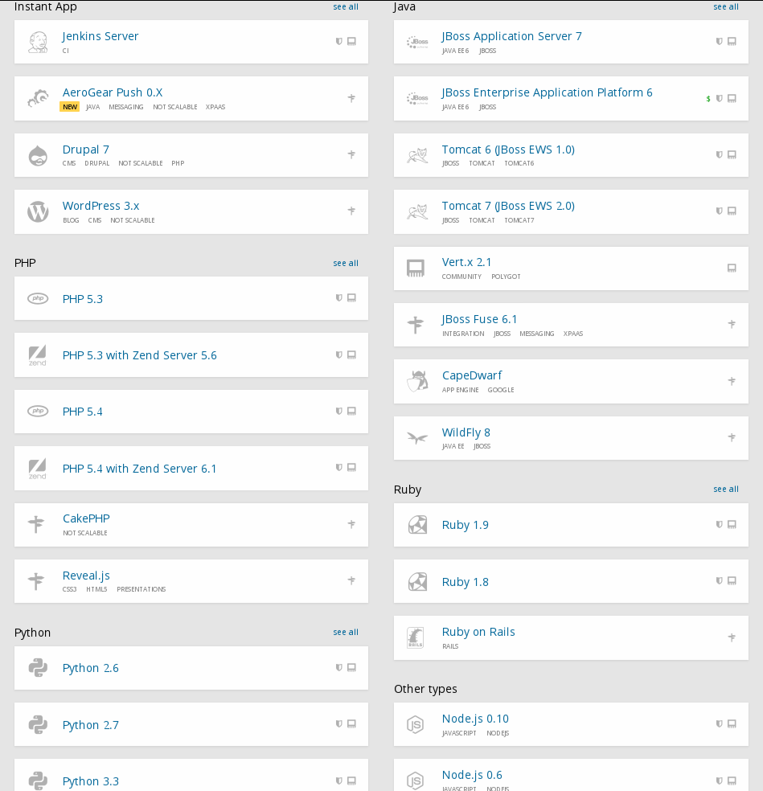
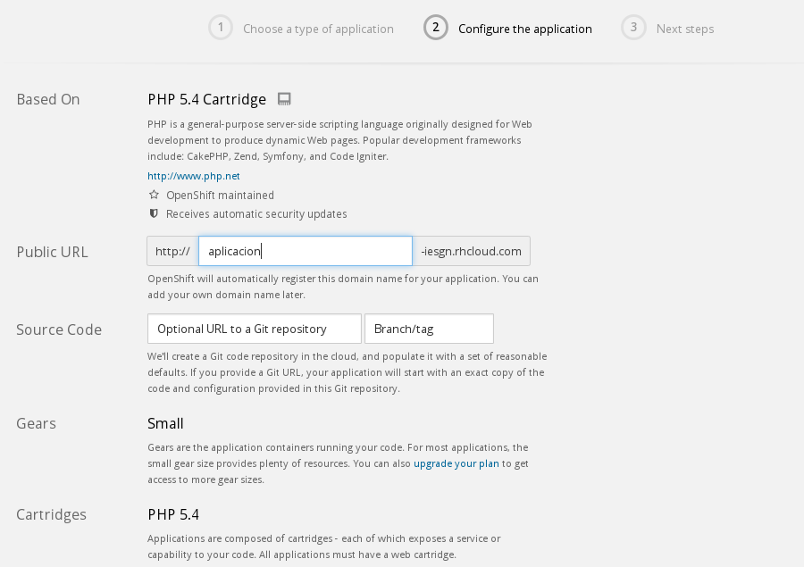
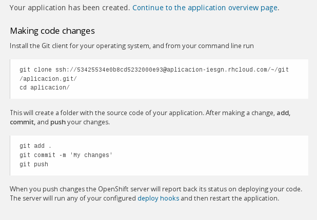
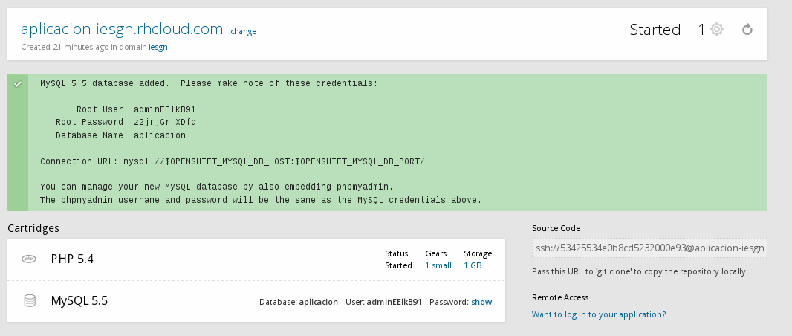

## Ejemplo: Instalación de Wordpress usando OpenShift Online

OpenShift es la Plataforma como servicio (PaaS) de cloud computing de Red Hat. OpenShift puede utilizarse de varias maneras, una de ellas es mediante su cloud público que se denomina OpenShift Online. En este documento vamos a explicar los pasos que hay que seguir para desplegar la aplicación web Wordpress en OpenShift Online utilizando una cuenta gratuita limitada.

###Conceptos previos

* Gear: Es un contenedor dentro de una máquina virtual con unos recursos limitados para que pueda ejecutar sus aplicaciones un usuario de OpenShift. En el caso de utilizar una cuenta gratuita  se pueden crear como máximo tres gears de tipo "small", cada uno de ellos puede utilizar un máximo de 512MB de RAM, 100MB de swap y 1GB de espacio en disco. Nuestra aplicación se desplegará y ejecutará utilizando estos recursos asociados al "gear".</
* Cartridge: Son contenedores de software preparados para ejecutarse en un gear. En principio sobre cada gear pueden desplegarse varios cartridges, por ejemplo existen cartridges de php, ruby, jboss, MySQL, django, etc. Por ejemplo para una aplicación como joomla necesitaremos los cartridges de PHP y MySQL.

### Acceso a OpenShift Online y configuración inicial

Accedemos a la URL (https://www.openshift.com/)[https://www.openshift.com/], nos damos de alta y accedemos con nuestra cuenta.

Cada cuenta de usuario en OpenShift Online está asociada a un "espacio de nombres" para generar un FQDN único para cada gear. En la configuración inicial de la cuenta habrá que seleccionar un espacio de nombres que sea único, este espacio de nombres se aplicará automáticamente a todos los gears que se creen. Supongamos a partir de ahora que nuestro espacio de nombres en OpenShift Online fuese "iesgn" y el primer gear que creásemos tuviera el nombre "aplicacion", entonces esta aplicación sería accesible a través de la url http://aplicacion-iesgn.rhcloud.com.

El acceso remoto a nuestras aplicaciones se hace usando el protocolo SSH. El mecanismo usado para la autentifcación ssh es usando claves públicas ssh, y es necesario indicar las claves públicas ssh que queramos usar para poder acceder de forma remota. Si no posees un par de claves ssh, puedes generar un par de claves rsa, usando el siguiente comando:

        $ ssh-keygen

Por defecto en el direcorio ~/.ssh, se generan la valve pública y la privada: id_rsa.pub y id_rsa. El contenido del fichero id_pub.pub es el que tienes que configurar en OpenShift.

### Creando nuestra aplicación (gear)

Durante el proceso de creación de una nueva aplicación, tenemos que configurar los siguientes elementos:

1) Elegir el cartridge (componente software) que necesitas para la implantación de tu aplicación web. En el caso de WordPress podemos elegir el componente PHP 5.4.

2) Debemos elegir la URL de acceso, teniendo en cuenta el espacio de nombres que habíamos configurado.

Una vez que se ha creado la aplicación (gear), se nos ofrece información del repositorio Git que podemos clonar a nuestro equipo local para poder subir los ficheros al gear. 

3) Podemos seguir añadiendo nuevos cartridge a nuestro gear. Demos añadir el cartridge MySql 5.5 para ofrecer el servicio de base de datos para nuestra aplicación.

